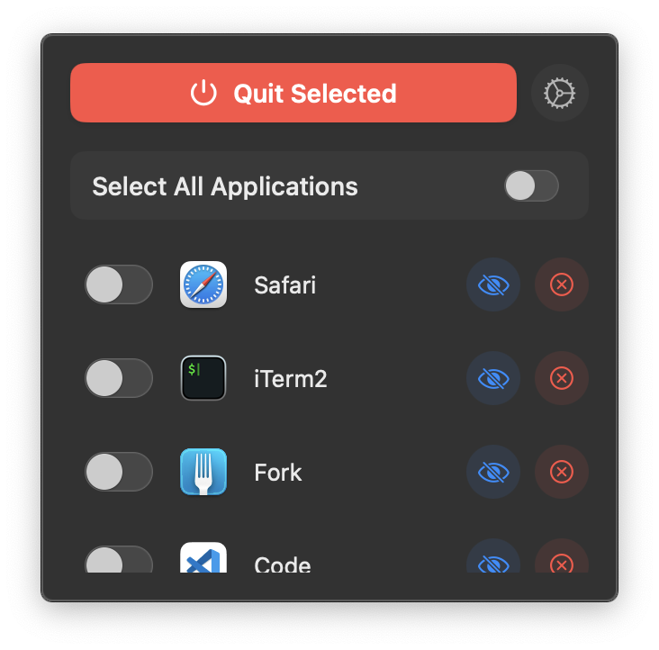
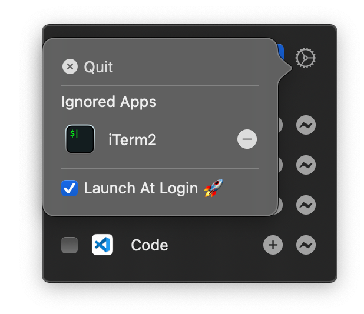

# QuitMe

    

QuitMe is a simple application that allows you to quit any application on macOS. It is a simple wrapper around the `kill` command.

## Development

- [x] Launch at Login (with [LaunchAtLogin](https://github.com/sindresorhus/LaunchAtLogin) library)
- [x] Quit selected applications
- [x] Ignore list
- [ ] Shortcut for quitting applications
- [ ] Quit/Force Quit option for applications
- [ ] Sound notification when quitting applications
- [ ] Show background processes as well
- [ ] Default quit option for applications
- [ ] Support for multiple languages
- [ ] Quit unused applications automatically after a certain period of time (add user confirmation before quitting this is optional)
- [ ] Maybe make a separate settings window instead of using a popover

## Installation

You can download the latest version of QuitMe from the [releases page]()

## Usage

The application is very simple to use. You can select the applications you want to quit from the list with checkboxes and click `Quit Selected` to quit them. You can also click for `Select All` checkbox to select all applications.

There is also ignore list that you can add applications to. These applications will not be shown in the list of applications to quit and will not be quit when you click `Quit Selected` while they are running.

If you want the application to start at login, you can check the `Launch at Login` checkbox as well.

    

`You can find the application in the menu bar. Click on the icon to show the application window.`

## License

This project is licensed under the MIT License - see the [LICENSE](LICENSE) file for details.

## Support

If you like the application and would like to support me, you can buy me a coffee.

Thank you!
